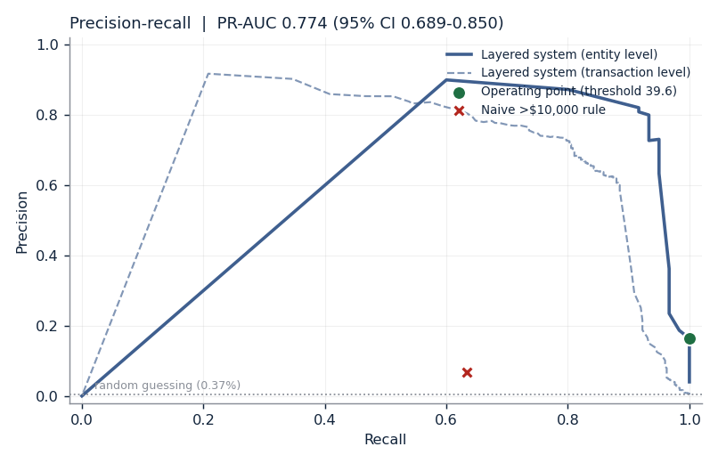
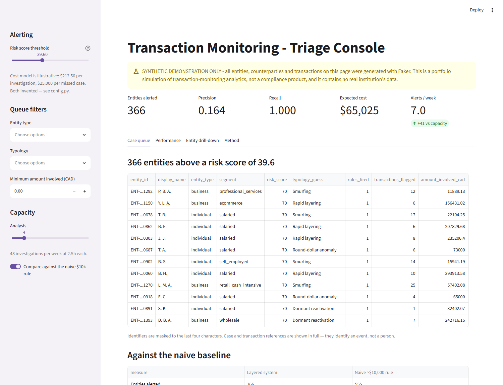
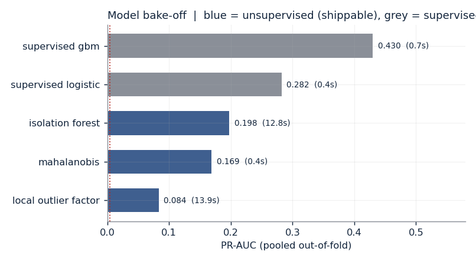
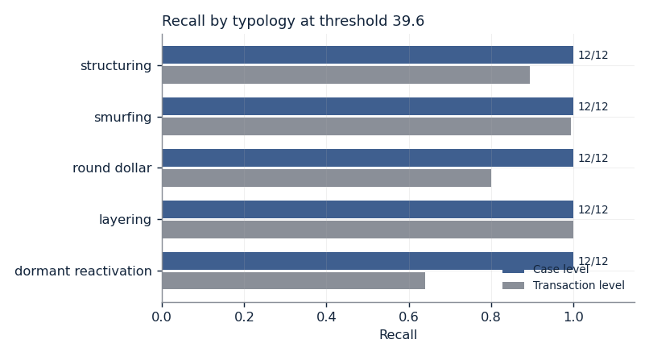
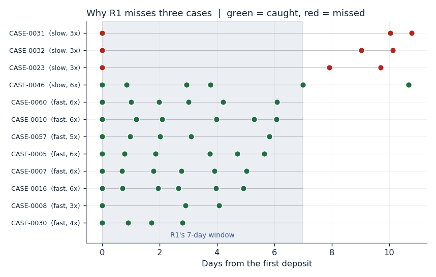
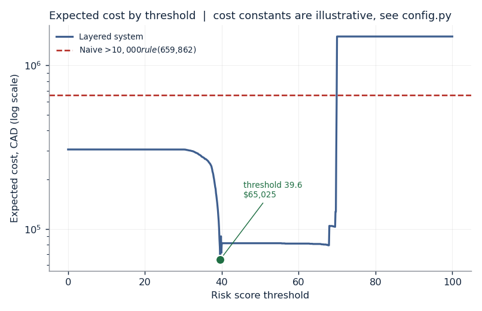

# Transaction Monitoring & Anomaly Detection

[](https://github.com/KushPatel29/aml-transaction-monitoring/actions/workflows/ci.yml)


> ### ⚠️ Synthetic demonstration only
> Every entity, counterparty and transaction in this repository was generated
> with Faker. This is an **educational portfolio simulation** of transaction
> monitoring analytics. It is **not a compliance product**, it is not built on
> or representative of any real institution's data, and it must not be
> presented as either. The typologies are modelled on *publicly described
> categories of suspicious-activity indicator*, genericised — no real
> institution, case, or regulatory filing is referenced anywhere in this
> repository. The cost constants are invented; see [`config.py`](config.py).

**▶ Live demo: [aml-transaction-monitoring.streamlit.app](https://aml-transaction-monitoring.streamlit.app)**

---

## The numbers

A layered detector — five deterministic rules plus an unsupervised anomaly
model — run over **100,299 synthetic transactions** across **1,500 entities**
and twelve months, with **60 suspicious cases** planted into 4% of entities
(**0.37%** of transactions).

| | Layered system | Naive `amount > $10,000` rule |
|---|---|---|
| Cases found | **60 / 60** | 38 / 60 |
| Entities alerted | **366** | 555 |
| Precision (entity) | **0.164** | 0.069 |
| Recall (entity) | **1.000** | 0.633 |
| Expected cost | **$65,025** | $659,862 |
| Alerts per week | **7.0** | 10.7 |

**PR-AUC 0.774** (95% CI 0.689–0.850), against a prevalence of 0.0037 — a
**207×** lift over random ranking. At transaction level, precision **0.252** and
recall **0.920**.

Every figure above and below is read from
[`results/metrics.json`](results/metrics.json), which is written by:

```bash
pip install -r requirements.txt && python run_pipeline.py
```

That command regenerates the data, rebuilds the SQLite warehouse, executes the
SQL feature layer, runs the rules, cross-validates the models, sweeps the
threshold and writes the metrics — **46 seconds** end to end. No number in this
README was typed in by hand, and a test
([`test_metrics_json_matches_the_committed_scored_output`](tests/test_pipeline_integrity.py))
fails the build if `metrics.json` stops describing the data actually in the repo.



---

## How it's built

### 1. Agree the grain

One row per monitored payment, from the monitored entity's point of view.
Counterparties are an external pool rather than other monitored entities, so
every transfer produces exactly one row and a ground-truth label is never
ambiguous about which side it belongs to. That models a single institution's
view, which is also its main limitation — see [what this misses](#what-this-system-misses).

The second grain decision matters more, and it is a correction to how these
systems are usually measured. **An entity with six flagged transactions is one
investigation, not six.** Costing false positives per transaction inflates the
bill by roughly 4× here. Both levels are computed; the entity level drives every
conclusion.

### 2. Contract the source

[`sql/01_schema.sql`](sql/01_schema.sql) is real DDL with real constraints.
Amounts are stored as **integer cents**, never floats — round-dollar detection
is a modulo test and the SQL/Python parity contract is exact equality, and both
die quietly on binary floating point.

Ground truth (`is_suspicious`, `typology`, `typology_variant`, `case_id`) lives
in the schema for evaluation and is quarantined from everything downstream. A
test asserts the model feature list and the ground-truth list have an empty
intersection, and a second asserts every model input has a definition in the SQL
layer — so nothing the model sees can escape the parity contract.

### 3. Model once

Fifteen features — trailing 7/30-day volume, an entity-relative z-score,
round-amount flag, dormancy gap, distinct counterparties, 48-hour pass-through
ratio, cash ratio, and three as-of counterparty-network features — are computed
**once** in [`sql/02_features.sql`](sql/02_features.sql), which is executed
verbatim: [`src/db.py`](src/db.py) reads the file and hands it to SQLite
untouched. The SQL a reviewer reads is the SQL that ran.

[`src/features.py`](src/features.py) reimplements all fifteen in pandas, and
[`test_sql_python_feature_parity`](tests/test_sql_python_feature_parity.py)
asserts the two agree on **all 100,299 rows** — not a sample. Three places that
contract is sharp about:

- **RANGE window frames include peers.** Rows sharing a timestamp sit in each
  other's frame regardless of row order, which a positional `.rolling()` gets
  wrong. The pandas mirror matches it with a right-inclusive `searchsorted`.
- **The z-score uses the one-pass `E[x²] − E[x]²` identity**, because that is
  what a single SQL window pass can express — and it is the numerically weaker
  form. So the test compares SQL against *both* a one-pass and a two-pass numpy
  implementation. Worst deviation across all rows: **2.9 × 10⁻¹¹**.
- **`counterparty_entity_degree_asof` is the feature most able to cheat.** A
  full-period degree would tell an early transaction how popular its
  counterparty eventually became. The test asserts it never exceeds the final
  degree, never decreases, and does converge to it — monotone and honest rather
  than merely plausible.

### 4. Test the claim

**155 tests.** The floors in [`config.py`](config.py) are regression guards set
at ~90% of what the first clean run produced, written down *after* measuring —
nothing was tuned to clear them. Three habits do the real work:

**Rules are deliberately looser than the generator.** R1 fires on cash deposits
from $7,500 while the generator plants $8,000–$9,999.99; R2 wants 70%
pass-through while the generator plants 90–98%. A rule tuned to the generator is
a fingerprint of it, and every metric downstream would be measuring the
data-generating process instead of a detector. A test asserts each threshold is
strictly looser than the parameter it detects.

**Evaluation is entity-disjoint, five-fold, pooled out-of-fold.** Sixty cases is
far too few for one split to say anything stable. Splitting by transaction
rather than entity would leak outright, because the features are
entity-relative.

**Confidence intervals resample entities, not transactions.** A case contributes
several correlated rows; resampling rows would count them as independent
evidence and produce intervals several times too narrow.

### 5. Ship auditable

Every alert carries a reason code an analyst can act on, written by the rule
that fired:

```
R1_STRUCTURING: 4 cash deposits totalling $35,600.00 in 6.0 days,
                each between $7,500 and $10,000
R2_LAYERING:    $80,000.00 inbound dispersed to 4 counterparties in 4
                transfers within 24h, 95% passed through
R5_DORMANT:     $4,000.00 after 121 days of no activity, 18.7x the
                entity's historical average of $213.60
```

The [triage console](app/streamlit_app.py) puts those in front of an analyst,
with a threshold slider, the cost curve, a per-entity drill-down and a
counterparty network view. Identifiers are masked structurally: every table
routes through one helper that masks first, and a test parses the app's AST to
assert that helper is the **only** caller of `st.dataframe` anywhere in the file.



---

## The rules, and what they cost

| Rule | Fired | True pos. | False pos. | Precision |
|---|---:|---:|---:|---:|
| `R1_STRUCTURING` | 51 | 48 | 3 | 0.941 |
| `R2_LAYERING` | 287 | 68 | 219 | 0.237 |
| `R3_SMURFING` | 160 | 155 | 5 | 0.969 |
| `R4_ROUND_DOLLAR` | 61 | 50 | 11 | 0.820 |
| `R5_DORMANT` | 12 | 12 | 0 | 1.000 |

R2's 219 false positives are not noise. **216 of the 219 come from wholesale
businesses** — 24 wholesalers (27 entities in total) that receive a large
settlement and then run a supplier payment batch inside 48 hours. From the
outside that is exactly what layering looks like, and it is the honest cost of a
rule loose enough to catch the real thing.

---

## The model bake-off, and what it's worth



| Model | | PR-AUC | ROC-AUC | Time |
|---|---|---:|---:|---:|
| IsolationForest | unsupervised | **0.198** | 0.951 | 13.3s |
| Mahalanobis distance | unsupervised | 0.169 | 0.936 | **0.4s** |
| Local Outlier Factor | unsupervised | 0.084 | 0.879 | 21.4s |
| Logistic regression | *supervised ceiling* | 0.282 | 0.953 | 0.4s |
| Gradient boosting | *supervised ceiling* | 0.430 | 0.821 | 0.8s |

Two results I'd rather report than bury.

**A centroid and a covariance matrix get within 15% of IsolationForest, 34×
faster.** Mahalanobis has no hyperparameters and no trees. IsolationForest ships
because it is still ahead, but the sophisticated answer was not obviously
necessary and the README should say so.

**The model earns its weight on ranking, not on the decision.** Ablating the
score shows it plainly:

| | PR-AUC | Optimal threshold | Precision | Recall | Alerts | Expected cost |
|---|---:|---:|---:|---:|---:|---:|
| Rules only | 0.518 | 50.0 | 0.640 | 0.950 | 89 | $81,800 |
| Model only | 0.198 | 98.9 | 0.152 | 0.983 | 388 | $94,912 |
| **Blended** | **0.774** | 39.6 | 0.164 | **1.000** | 366 | **$65,025** |

The blend ranks far better than either part — but against rules alone it saves
**$1,487**, about 1.8%. Its real value is putting the right cases at the top of
the queue for an analyst working top-down, not in the accept/reject decision at
the threshold. The two supervised rows are a **ceiling, not a product**: they are
trained on the ground-truth labels, and they exist to size what clean historical
labels would buy — which teams doing this work rarely have.

---

## Against the naive baseline

The thing to beat: **flag every transaction over $10,000 CAD.**

| Entity level | Layered | Naive | |
|---|---:|---:|---|
| Cases found | 60 / 60 | 38 / 60 | +58% |
| Entities alerted | 366 | 555 | −34% |
| Precision | 0.164 | 0.069 | **2.4×** |
| Expected cost | $65,025 | $659,862 | **−90.1%** |

At transaction level the gap is starker: the naive rule flags 10,132
transactions to find 121 suspicious ones (precision **0.012**), because 10,011
perfectly ordinary business payments clear $10,000 in this population.

It also cannot see structuring at all *by construction* — every structured
deposit is under $10,000 on purpose — which is precisely why threshold reporting
alone was never the whole answer.



---

## What this system misses

Not a disclaimer. These came out of running the pipeline and reading the
failures.

### 1. Structuring evades the rule window when the depositor spreads *and* thins

At the cost-optimal threshold the system catches all 60 cases. But that
threshold is chosen under an invented cost ratio; at the conservative threshold
(67.9, which is optimal if a missed case costs $5,000) **three cases escape, and
all three are slow structuring**.



The mechanism is arithmetic, and the shape of the failure is not what I
expected. R1 needs three deposits inside seven days. Spreading the deposits out
is *not enough on its own* — `CASE-0046` spread six deposits across 10.7 days
and still packed four into one week, so R1 caught it. The three that got away
used **three deposits across 9.7–10.8 days**, leaving at most **two** in any
seven-day window. You have to spread *and* keep the count low.

The sharper part: **the anomaly model ranked all three in its top 1%** of
100,299 transactions. The detector saw them. The *scoring architecture* threw
them away — a transaction no rule fires on is structurally capped at 40 points
(`0.4 × 100`), so no amount of model confidence clears a threshold of 67.9. That
is a design consequence of weighting rules at 60%, which is a defensible policy
(don't alert on model suspicion alone, because you cannot explain it) with a
measurable price.

And the naive baseline never had a chance at them either: **none of the 15 slow
deposits clears $10,000**.

### 2. Transaction-level recall on dormant reactivation is 0.640, case-level is 12/12

R5 fires on the *first* transaction after a silence. Where a case reactivates
with two or three transactions over consecutive days, the later ones have a
one-day gap and never trip it. At the level an analyst actually works — the
entity — every dormant case is caught. It is a good illustration of why the
transaction-level number, which the brief asks for, is the wrong unit for an
operational claim.

### 3. The single-institution view is a modelling simplification

Counterparties are external, so the system never sees both legs of a transfer.
A real institution sometimes does, and that extra signal is not available to this
model. Stated up front rather than discovered.

### 4. Sixty cases is a small sample, and the intervals say so

Entity precision is 0.164 with a 95% CI of **0.126–0.203**. PR-AUC is 0.774 with
a CI of **0.689–0.850**. Quoting the point estimates without the intervals would
be overselling a sample this size, which is also why evaluation is five-fold
pooled out-of-fold rather than one split.

### 5. The cost-optimal threshold is downstream of a number I invented



The optimum is stable between $25,000 and $100,000 per missed case, and moves
sharply below that:

| If a missed case costs | Optimal threshold | Precision | Recall | Alerts |
|---|---:|---:|---:|---:|
| $5,000 | 67.9 | 0.731 | 0.950 | 78 |
| $25,000 *(default)* | 39.6 | 0.164 | 1.000 | 366 |
| $100,000 | 39.6 | 0.164 | 1.000 | 366 |

A 5× change in one invented constant moves precision from 0.73 to 0.16 and alert
volume from 78 to 366. **Treat the shape of the cost curve as the finding and the
dollar figure as an illustration.** The constants are labelled `ILLUSTRATIVE` in
[`config.py`](config.py) and a test fails if that labelling is removed.

Two smaller notes on honesty in the same spirit. The cost surface **steps**
wherever a case crosses the threshold — an integer 0–100 sweep reported an
optimum 19% more expensive than the real one, so the sweep runs at 0.1
resolution. And the pooled optimum is chosen using the same data it is then
measured on, so the pipeline also selects the threshold on training folds and
applies it to held-out ones: folds independently pick 39.6, 39.6, 39.9, 39.6,
39.9, and held-out recall is **0.967** against a pooled 1.000. That gap is the
size of the optimism, reported rather than assumed away.

---

## Running it

```bash
pip install -r requirements.txt
python run_pipeline.py          # regenerates everything, ~46s
pytest                          # 155 tests
streamlit run app/streamlit_app.py
```

`run_pipeline.py --skip-generate` reuses the committed data. The dashboard reads
the committed artefacts, so it starts cold without a pipeline run.

### Deploying

Live on **Streamlit Community Cloud** free tier at
[aml-transaction-monitoring.streamlit.app](https://aml-transaction-monitoring.streamlit.app):
no API keys, no paid services, no database server, and a test asserts the source
contains no secrets or network calls. It reads the committed artefacts, so it
starts cold without running the pipeline.

To redeploy it yourself: point Streamlit Cloud at this repo, branch `main`,
entrypoint `app/streamlit_app.py`, and **set the Python version to 3.12 under
Advanced settings**. That last part matters — Streamlit currently defaults new
apps to 3.14, and the pinned versions in `requirements.txt` have no wheels for
it, so the build fails on install before Streamlit is ever reached.

### Porting to PostgreSQL

SQLite is used so the repo is runnable with zero setup, but the schema is
written so Postgres is a mechanical diff rather than a rewrite. The full list is
in [`sql/01_schema.sql`](sql/01_schema.sql); the substantive ones:

- `txn_epoch` exists **only** because Postgres supports
  `RANGE BETWEEN INTERVAL '7 days' PRECEDING` directly on a timestamp `ORDER BY`
  and SQLite does not. On Postgres the helper column goes away.
- `INTEGER` 0/1 flags become `BOOLEAN`; `= 1` comparisons become the bare column.
- `strftime('%H'|'%w', …)` becomes `EXTRACT(HOUR|DOW FROM …)` — same 0=Sunday coding.
- The correlated subqueries (`COUNT(DISTINCT …)` is not a window function in
  *either* engine) become lateral joins. At 100k rows they cost 2.4s; at
  warehouse scale you would rewrite them as self-joins with `GROUP BY`, or reach
  for approximate distinct counting.

---

## Repository map

```
config.py                     every tunable, including the ILLUSTRATIVE cost block
run_pipeline.py               one command, end to end
data/generate_transactions.py Faker generator + five typology injectors
sql/01_schema.sql             DDL, Postgres-portable
sql/02_features.sql           the feature layer, executed verbatim
src/db.py                     builds SQLite, runs sql/ untouched
src/features.py               pandas mirror of the feature layer  (C2)
src/rules_engine.py           R1-R5 with human-readable reason codes
src/anomaly_model.py          entity-disjoint CV, model bake-off
src/risk_scorer.py            blend, sweep, nested check, bootstrap
src/cost_model.py             confusion, consolidation, naive baseline
src/masking.py                identifier masking for anything rendered
app/streamlit_app.py          triage console
docs/make_figures.py          the charts above, from results/
results/metrics.json          every number in this README
tests/                        155 tests
```

## Constraint traceability

| | Where |
|---|---|
| Synthetic only, disclaimer in README + app | `tests/test_no_pii_in_data.py`, `render_disclaimer()` |
| SQL ↔ Python parity | `tests/test_sql_python_feature_parity.py` (17 columns, 100,299 rows) |
| Every README number from `metrics.json` | `test_metrics_json_matches_the_committed_scored_output` |
| One-command setup + CI | `run_pipeline.py`, `.github/workflows/ci.yml` |
| Free-tier deployable, no keys | `test_app_requires_no_secrets_or_network` |
| SQLite with a Postgres path | `sql/01_schema.sql` |
| Naive baseline beaten, with numbers | `test_layered_system_beats_the_naive_baseline` |
| Cost constants clearly illustrative | `test_cost_constants_are_flagged_illustrative_in_config` |
| No real institutions, cases or filings | `test_no_real_institutions_or_filings_named` |

---

## License

MIT — see [LICENSE](LICENSE). The data is synthetic and carries no restrictions,
because there is nothing real in it.
